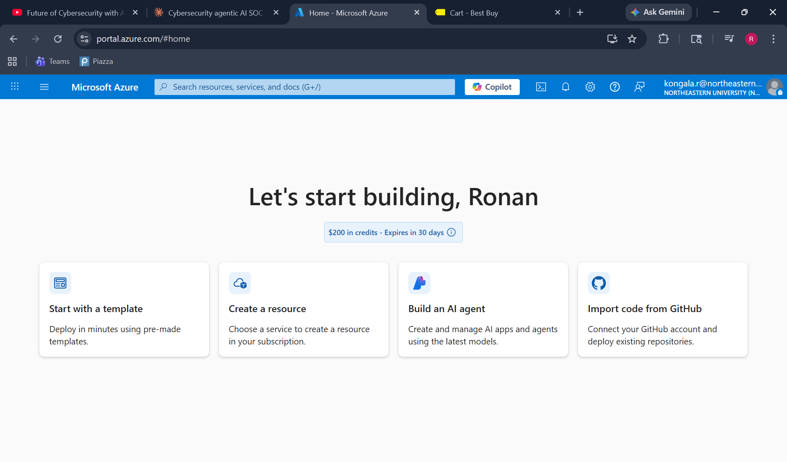
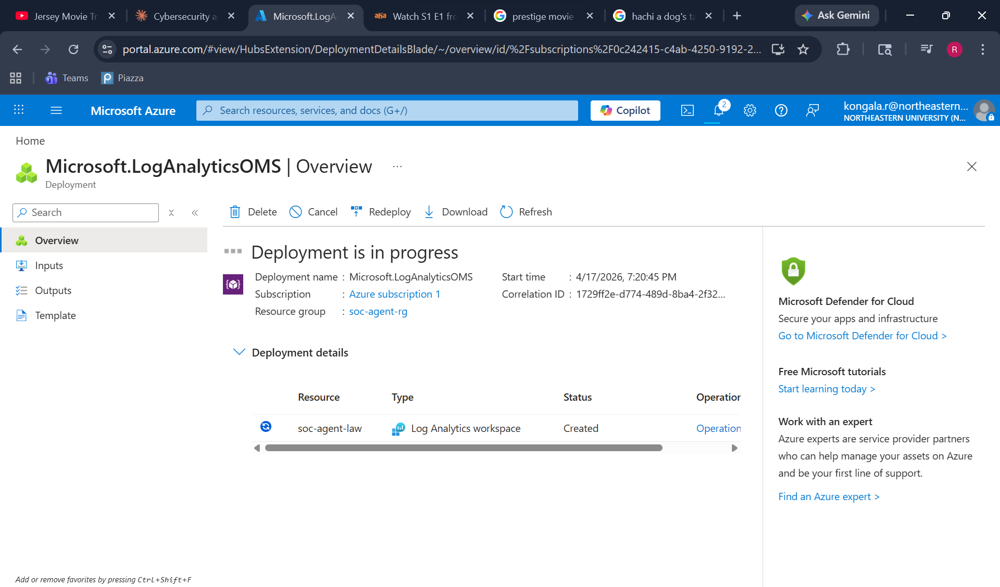
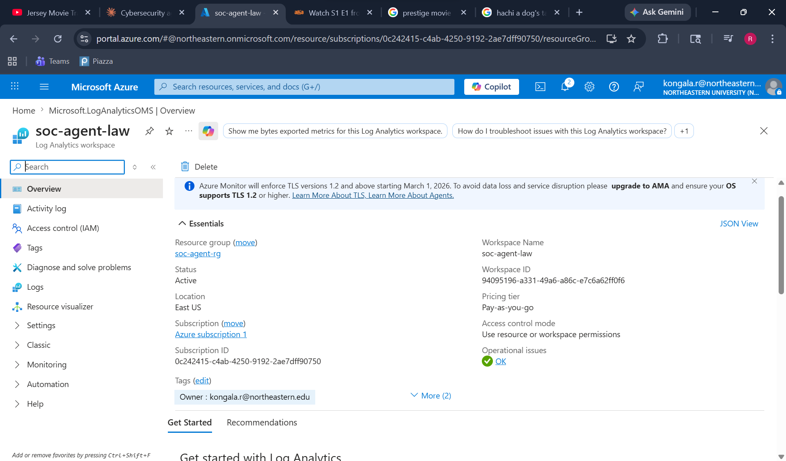
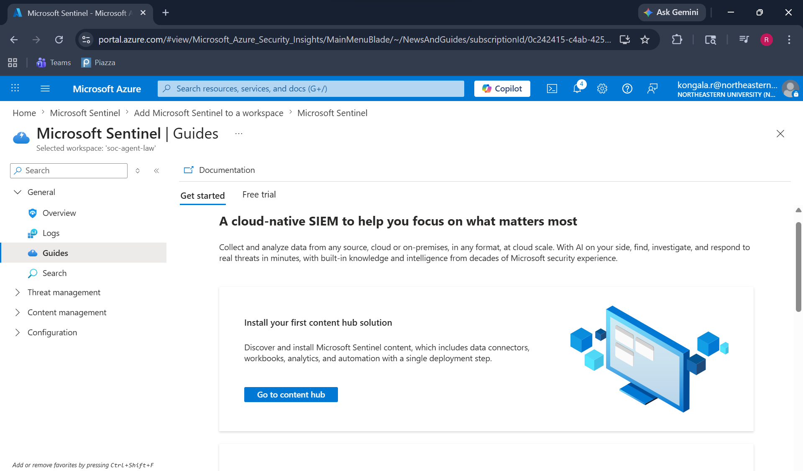
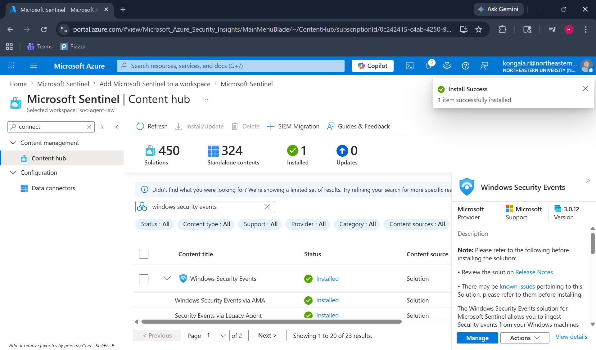
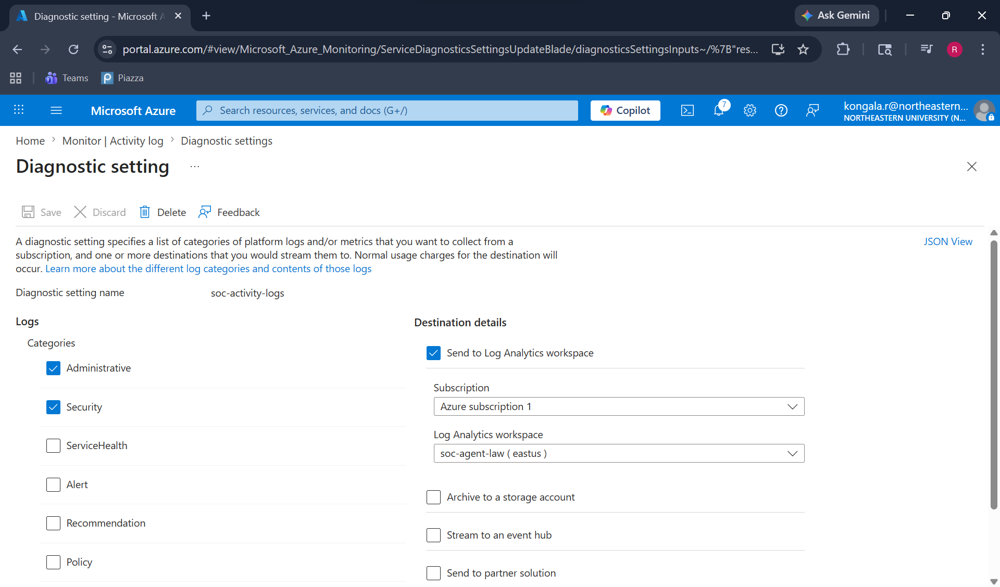
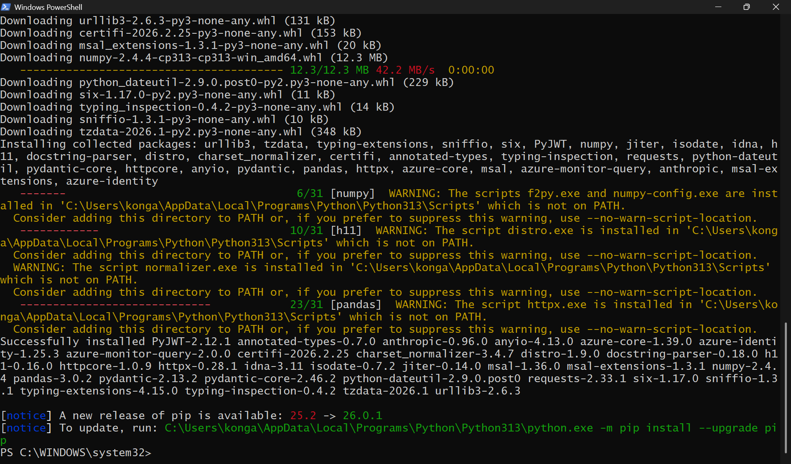
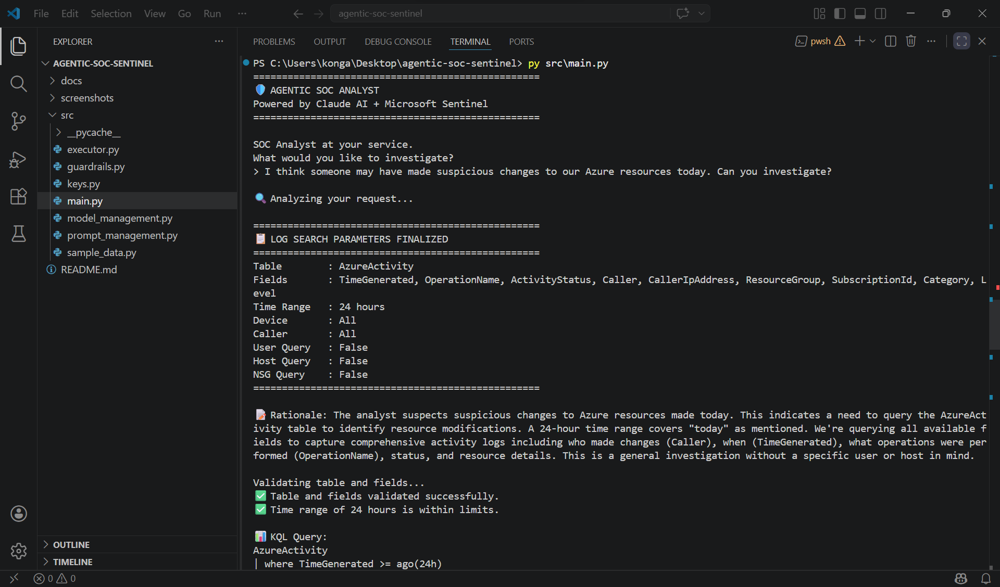
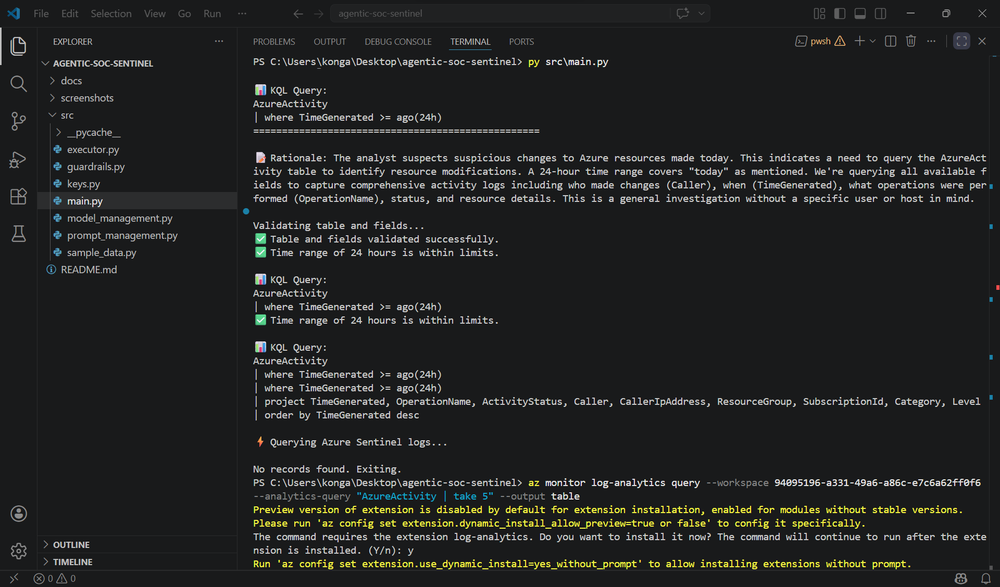
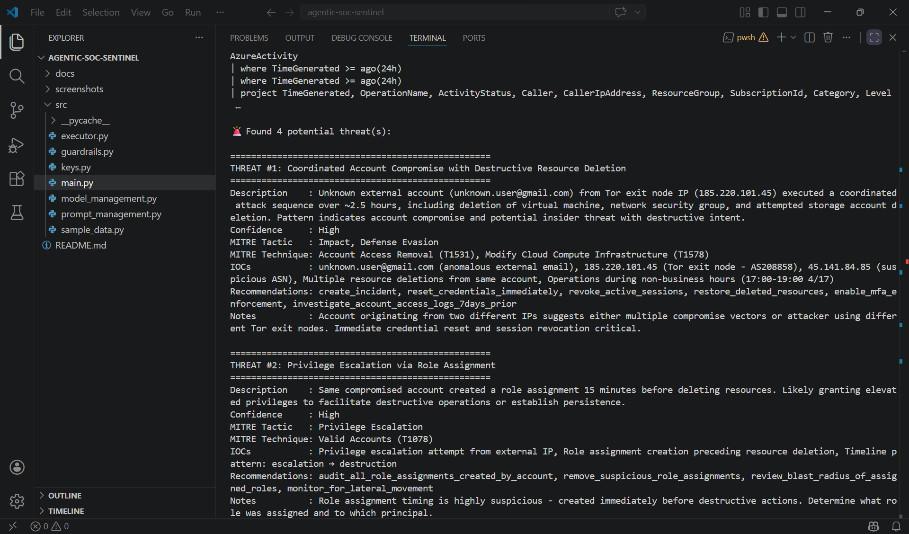

# 🛡️ Agentic SOC Analyst
### Powered by Claude AI + Microsoft Sentinel

An autonomous AI-powered Security Operations Center (SOC) analyst that detects, investigates, and responds to security threats using natural language processing and Microsoft Sentinel.

---

## 🎯 Project Overview

| | |
|---|---|
| **Author** | Ronan Kongala |
| **Date** | April 2026 |
| **University** | Northeastern University |
| **Program** | MS Cybersecurity |

---

## 🤖 How It Works

The agent operates in a fully autonomous loop:

1. SOC analyst describes concern in **plain English**
2. **Claude AI** decides which Sentinel table to investigate
3. Agent validates against **security guardrails**
4. **KQL query** is automatically built and executed
5. Claude **hunts through logs** for threats
6. Findings returned with **MITRE ATT&CK mapping**

---

## 🏗️ Architecture

```
User Input (Natural Language)
        ↓
Claude AI - Call #1 (Query Decision)
        ↓
Guardrails Validation (Table + Field + Model)
        ↓
Azure Sentinel + Log Analytics (KQL Query)
        ↓
Claude AI - Call #2 (Threat Hunt)
        ↓
Structured Threat Report + MITRE ATT&CK Mapping
```

---

## 🔧 Tech Stack

| Component | Technology | Purpose |
|---|---|---|
| AI Engine | Claude AI (Anthropic) | Query decisions + Threat hunting |
| SIEM | Microsoft Sentinel | Security monitoring |
| Log Analytics | Azure Log Analytics | Log storage + KQL queries |
| Language | Python 3.13 | Agent orchestration |
| Auth | Azure CLI + DefaultAzureCredential | Azure authentication |
| Data | Azure Activity Logs | Security events |

---

## 📸 Implementation Flow

### Phase 1: Azure Infrastructure Setup

*Azure account with $200 credits via Northeastern University*


*Resource group created for project isolation*


*Log Analytics workspace - central log repository*

### Phase 2: Microsoft Sentinel Setup

*Microsoft Sentinel enabled and connected to workspace*


*Windows Security Events content installed*

### Phase 3: Data Sources Connected

*Azure Activity logs flowing into Sentinel*

### Phase 4: Python Agent Built

*All required Python packages installed*


*Claude AI autonomously deciding which table and fields to investigate*


*Security guardrails validating table, fields and time range*

### Phase 5: Threat Hunting Results

*Claude AI identifying 4 threats with MITRE ATT&CK mapping*

---

## 🚨 Sample Threat Hunt Results

The agent identified **4 threats** including:

| Threat | Confidence | MITRE Tactic |
|---|---|---|
| Coordinated Account Compromise + Resource Deletion | High | Impact, Defense Evasion |
| Privilege Escalation via Role Assignment | High | Privilege Escalation |
| Unauthorized Storage Key Access | High | Credential Access |
| Firewall Rule Modification | Medium | Defense Evasion, Persistence |

All findings include:
- ✅ MITRE ATT&CK tactic + technique mapping
- ✅ Indicators of Compromise (IOCs)
- ✅ Confidence ratings
- ✅ Actionable recommendations

---

## 🛡️ Security Guardrails

| Guardrail | Purpose |
|---|---|
| Table allowlist | Only approved Sentinel tables can be queried |
| Field-level validation | Only approved fields per table |
| Model allowlist | Only approved Claude models |
| Time range limits | Max 7 days lookback |
| API key protection | Keys excluded via .gitignore |

---

## 📁 Project Structure

```
agentic-soc-sentinel/
│
├── README.md
│
├── screenshots/
│   ├── phase1_azure_setup/
│   ├── phase2_sentinel_setup/
│   ├── phase3_data_sources/
│   ├── phase4_python_agent/
│   ├── phase5_threat_hunting/
│   └── phase6_remediation/
│
├── src/
│   ├── main.py               # Entry point
│   ├── executor.py           # Core agent functions
│   ├── prompt_management.py  # All Claude prompts
│   ├── guardrails.py         # Security guardrails
│   ├── model_management.py   # Model configuration
│   ├── sample_data.py        # Sample logs for testing
│   └── keys.py               # API keys (not committed)
│
└── docs/
    └── setup-guide.md
```

---

## 🚀 Setup & Installation

### Prerequisites
- Python 3.13+
- Azure CLI
- Anthropic API key
- Azure subscription with Sentinel

### Installation

```bash
# Clone repo
git clone https://github.com/ronankongala/agentic-soc-sentinel.git
cd agentic-soc-sentinel

# Install dependencies
pip install anthropic azure-identity azure-monitor-query pandas

# Configure keys
# Add your API keys to src/keys.py

# Login to Azure
az login

# Run the agent
py src/main.py
```

### Example Usage

```
SOC Analyst at your service.
What would you like to investigate?
> I think someone may have made suspicious changes to our Azure
  resources today. Can you investigate?

🔍 Analyzing your request...
📋 Table: AzureActivity | Time Range: 24 hours
✅ Guardrails validated
🎯 Threat hunt complete - Found 4 potential threats
```

---

## 🆚 Comparison with Traditional SOC

| Aspect | Traditional SOC | This Agent |
|---|---|---|
| Investigation trigger | Manual alert review | Natural language |
| Table selection | Manual analyst decision | Claude AI autonomous |
| Query building | Manual KQL writing | Automatically generated |
| Log analysis speed | Hours | Seconds |
| MITRE mapping | Manual lookup | Automatic |
| Guardrails | Policy documents | Code-enforced |

---

## 🎓 Skills Demonstrated

- **Agentic AI Architecture** -- Multi-step autonomous decision making
- **Microsoft Sentinel** -- Cloud-native SIEM deployment
- **KQL Automation** -- Programmatic query generation
- **Prompt Engineering** -- Structured Claude AI interactions
- **Azure Cloud Security** -- Log Analytics, Diagnostic Settings
- **Python Automation** -- End-to-end pipeline
- **Security Guardrails** -- Responsible AI design
- **MITRE ATT&CK** -- Threat framework mapping

---

## 🔮 Future Improvements

- [ ] Connect live Sentinel data connectors
- [ ] Add VM isolation via Azure REST API
- [ ] Implement Slack/Teams alerting
- [ ] Add more Sentinel tables
- [ ] Build web UI dashboard
- [ ] Add automated incident creation
- [ ] Implement PII redaction before AI analysis

---

## 📧 Contact

**Ronan Kongala**
MS Cybersecurity @ Northeastern University
- Email: kongalaronan@gmail.com
- LinkedIn: [linkedin.com/in/ronan-kongala](https://linkedin.com/in/ronan-kongala)
- GitHub: [github.com/ronankongala](https://github.com/ronankongala)